# School District Analysis

## Overview

Perform analysis on school district information. Using school and student data, show any potential trends and patterns. To keep the data as accurate as possible, Thomas High School ninth grade math and reading scores will be changed to NaN due to academic dishonestly. Further analyze how changing the Thomas High School data affects the results. 

### Purpose

Create the following metrics for analysis:
-	District summary
-	School summary
-	Top 5 and bottom 5 performing schools on overall passing rate
-	Average math scores for each grade level from each school
-	Average reading scores for each grade level from each school
-	Scores by school spending per student, by school size, and by  school type

## District Analysis

### District Summary

School district summary before changes:

School district summary after changes:
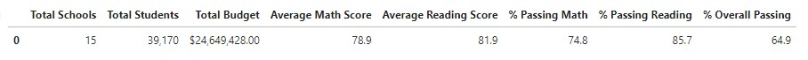

Although the two are rounded to different decimals and formatted differently, it is clear that the data (district wide) is affected only marginally by the changed the Thomas High School scores. The average scores and percentage passing scores drop slightly. For example, rounding the percent overall passing from the previous school summary to 65.2%, there is only a difference of 0.3% compared to the summary after the changes. Since the scores tend to drop slightly, the ninth-grade scores must have had a positive impact on the data i.e., the percent passing was high.

### School Summary

Per School Summary before (using top performing schools): 
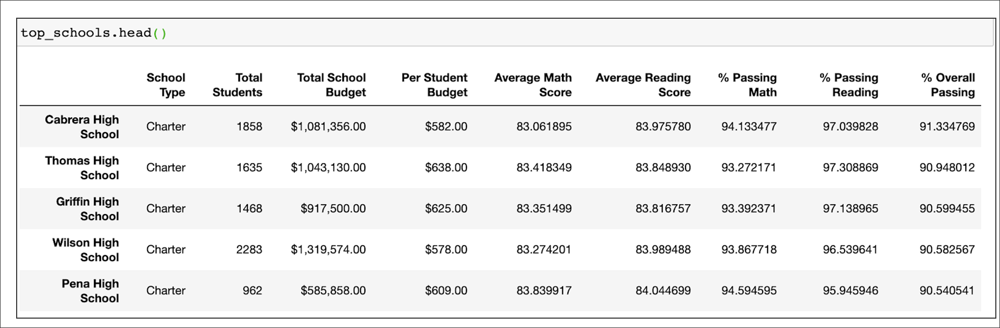

Per School Summary after:
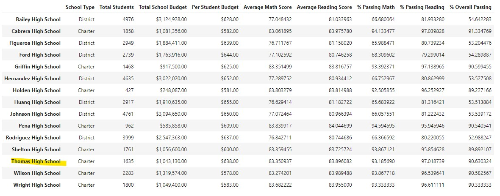

For Thomas High School	, the average math and reading scores stays relatively close when changing the scores for ninth graders to NaN. The average math score decreases approximately by .06 (from 83.41 to 83.35) and the average reading score increases by about .05 (from 83.84 to 83.89).

The percent passing math, reading, and overall has around the same marginal changes. The percent passing math decreases by approximately .08% (from 93.27 to 93.19), the percent passing reading decreases by about .29% (from 97.31 to 97.02), and the overall percent passing decreases by around .32% (from 90.95 to 90.63).

While there is an increase in the average reading score, there is a decrease in the percent passing reading. This signifies that there was a large portion of ninth-graders that passed even though their average score was less than the 10th-12th graders average score. This is also true for the reading scores and percent overall passing, there was a higher number of students passing with ninth-grade scores and removing them from consideration brings the overall passing scores down. 

### School performance

Thomas High School’s performance before:

Thomas High School's performance after:
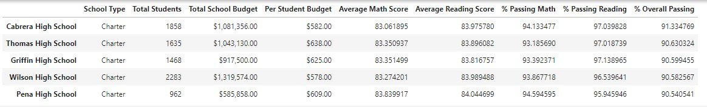

Before and after replacing the ninth-grader’s math and reading scores, Thomas High School remains in second place in the top performing schools. While before, Thomas High School was closer to Cabrera High School, now Thomas High School is closer to Griffin High School in performance. 

### Scores by Category

##### Math and Reading scores by grade

Reading scores by grade:
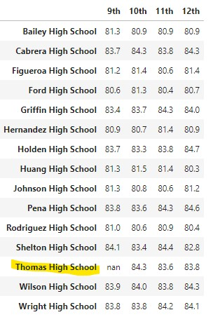

Math scores by grade:
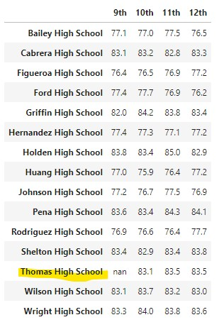

For the Thomas High School scores by grades data frames, the only effect on changing the scores for 9th grade to NaN simply creates a null value for that column in the 9th grade scores. The original average reading score for 9th grade was 83.7 and 83.6 for math which appears to be pretty consistent with the 10th through 12th grade scores. 

Thomas High School with spending ranges per student and school size added:
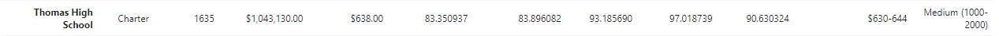

#### Scores by school spending (formatted)

Scores by school spending before:
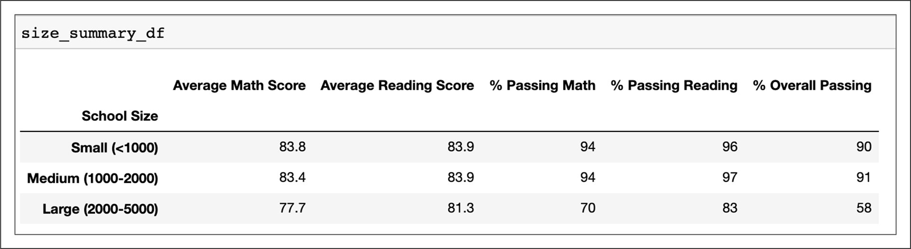

Scores by school spending after:
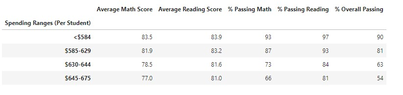

Thomas High School belongs to the $630-644 spending range.

After changing the score values for ninth-graders for Thomas High School, there appears to be no change in the scores by school spending data frame values. Thomas High School remains in the same spending range before and after the changes were made. If there was any disturbance in the average scores and the percentage of passing students, it was minimal that after rounding there is no difference. The same is true for the scores by school type and scores by school size. Therefore to get an idea of the actual changes happening the formatted data frames won’t be useful. However, we can draw the conclusion that not much actually changes in our analysis when we replace the ninth-grade scores from the data set.

#### Scores by school spending (not formatted)

##### Scores by school size 

Scores by school size before:

Scores by school size after:
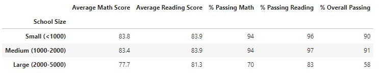

Thomas High School belongs to the medium range for school size.

##### Scores by school type 

Scores by school type before:

Scores by school type after:
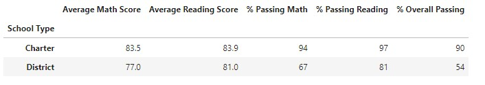

Thomas High School belongs to the charter school type.

