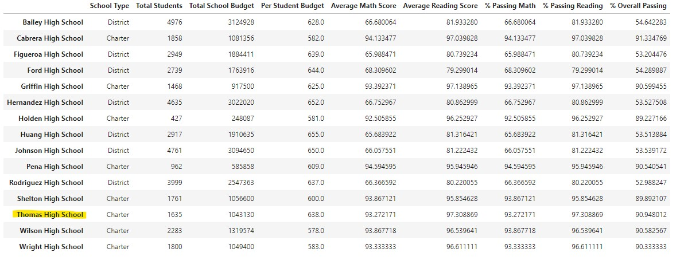

# School District Analysis

## Overview

Perform analysis on school district information. Using school and student data, show any potential trends and patterns. To keep the data as accurate as possible, Thomas High School ninth grade math and reading scores will be changed to NaN due to academic dishonestly.

### Purpose

Create the following metrics for analysis:
-	District summary
-	School summary
-	Top 5 and bottom 5 performing schools on overall passing rate
-	Average math scores for each grade level from each school
-	Average reading scores for each grade level from each school
-	Scores by school spending per student, by school size, and by  school type

## District Analysis

### District Summary

School district summary before changes:

School district summary after changes:

Although the two are rounded to different decimals and formatted differently, it is clear that the data (district wide) is affected only marginally by the changed the Thomas High School scores. The average scores and percentage passing scores drop slightly. For example, rounding the percent overall passing from the previous school summary to 65.2%, there is only a difference of 0.3% compared to the summary after the changes. Since the scores tend to drop slightly, the ninth-grade scores must have had a positive impact on the data i.e., the scores were high.

### School Summary

Per School Summary before: 

Per School Summary after:

Specifically looking at Thomas High School, the average math and reading scores are drastically affected by the ninth-grade data. The average math score drops roughly 10% (from 93.3% to 83.4%) while the average reading scores drop roughly 13.4% (from 97.3% to 83.9%) when the data is replaced with NaN.

However, the percent passing math, reading, and overall data isn’t affected by much with only around a 0.1-0.3% change. While the ninth-grade data tends to increase the average scores, the percent passing remains relatively neutral.

### School performance

Thomas High School’s performance before:

Thomas High School's performance after:

Before and after replacing the ninth-grader’s math and reading scores, Thomas High School remains in second place in the top performing schools. While before, Thomas High School was closer to Cabrera High School, now Thomas High School is closer to Griffin High School in performance. 
